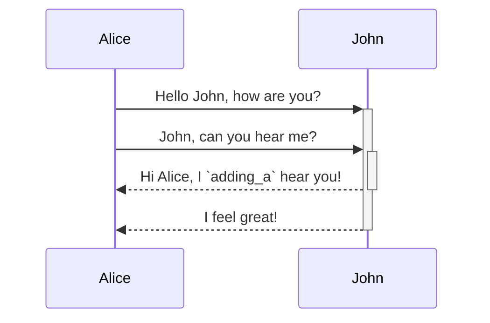

<!-- NOTE-swimm-snippet: the lines below link your snippet to Swimm -->
<!-- NOTE-swimm-repo ::Z2l0aHViJTNBJTNBYmFja29mZmljZSUzQSUzQXN3aW1taW8=:: -->
### 📄 src/assets/base.css
```css
9      ::-webkit-scrollbar {
10       width: 20px;
11     }
```

<br/>

`import`<swm-token data-swm-token="Z2l0aHViJTNBJTNBc3dpbW0tbGFicyUzQSUzQXN3aW1taW8=:main.py:11:0:0:`import tempfile`"/>

`📄(docs.swimm.io) src/css`

<br/>

<!--MERMAID {width:100}-->

<!--MCONTENT {content: "sequenceDiagram<br/>\nAlice->>+John: Hello John, how are you?<br/>\nAlice->>+John: John, can you hear me?<br/>\nJohn\\-\\-\\>>-Alice: Hi Alice, I `adding_a`<swm-token data-swm-token=\"Z2l0aHViJTNBJTNBc3dpbW0tbGFicyUzQSUzQXN3aW1taW8=:main.py:19:8:8:`from labs.generate import adding_a`\"/> hear you!<br/>\nJohn\\-\\-\\>>-Alice: I feel great!<br/>\n\n<br/>"} --->

<br/>

[swimm/Segment <> Slack Integrationaasdasdasdasd](https://app.swimm.io/repos/veezvxCuzpPrRLLXWD2E/docs/0238g)

<br/>

<br/>

This file was generated by Swimm. [Click here to view it in the app](https://app.swimm.io/repos/Z2l0aHViJTNBJTNBY3NoYXJwLXNoYXVsLXRlc3QlM0ElM0Fzd2ltbWlv/docs/zfgtvawq).
