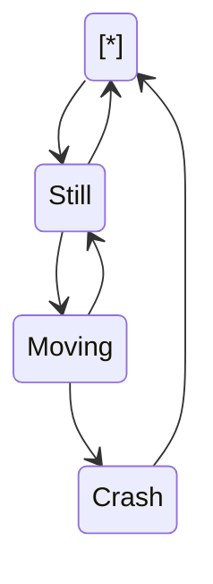

<!--MERMAID {width:100}-->

<!--MCONTENT {content: "stateDiagram-v2 \n\\[\\*\\] \\-\\-\\> Still \nStill \\-\\-\\> \\[\\*\\] \nStill \\-\\-\\> Moving \nMoving \\-\\-\\> Still \nMoving \\-\\-\\> Crash \nCrash \\-\\-\\> \\[\\*\\] \n\n "} --->

 

This file was generated by Swimm. [Click here to view it in the app](https://swimm-web-app.web.app/repos/Z2l0aHViJTNBJTNBY3NoYXJwLXNoYXVsLXRlc3QlM0ElM0Fzd2ltbWlv/docs/gby47omg).
