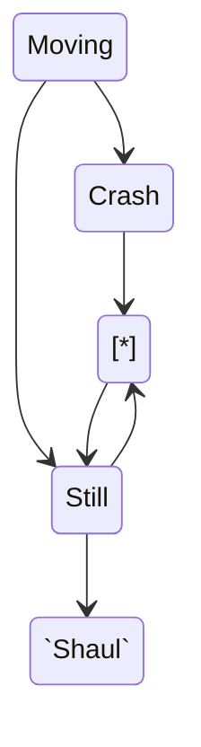

<!--MERMAID {width:25}-->

<!--MCONTENT {content: "stateDiagram-v2 \n\\[\\*\\] \\-\\-\\> Still \nStill \\-\\-\\> \\[\\*\\] \nStill \\-\\-\\> `Shaul`<swm-token data-swm-token=\":repositories/TreatmentRepository.cs:10:3:3:`        public Shaul`\"/> \nMoving \\-\\-\\> Still \nMoving \\-\\-\\> Crash \nCrash \\-\\-\\> \\[\\*\\] \n "} --->

 

<!--MERMAID {width:50}-->

<!--MCONTENT {content: "classDiagram \nAnimal <|-- Duck \nAnimal <|-- Fish \nAnimal <|-- Zebra \nAnimal : +int age \nAnimal : +String gender \nAnimal: +isMammal() \nAnimal: +mate() \nclass Duck{ \n+String beakColor \n+swim() \n+quack() \n} \nclass Fish{ \n\\-int sizeInFeet \n\\-canEat() \n} \nclass Zebra{ \n+bool is\\_wild \n+run() \n} \n "} --->

 

This file was generated by Swimm. [Click here to view it in the app](http://localhost:5001/repos/Z2l0aHViJTNBJTNBY3NoYXJwLXNoYXVsLXRlc3QlM0ElM0Fzd2ltbWlv/docs/gby47omg).
