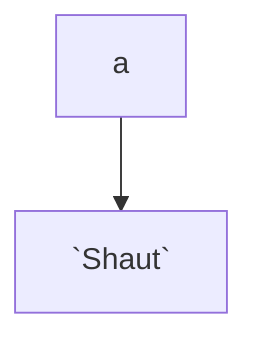

test

 

<!--MERMAID {width:100}-->

<!--MCONTENT {content: "graph TD \na \\-\\-\\> `Shaut`<swm-token data-swm-token=\":repositories/TreatmentRepository.cs:9:3:3:`        public Shaut`\"/>"} --->

 

asdasdasd

 

This file was generated by Swimm. [Click here to view it in the app](https://app.swimm.io/repos/Z2l0aHViJTNBJTNBY3NoYXJwLXNoYXVsLXRlc3QlM0ElM0Fzd2ltbWlv/docs/3uilhbnn).
