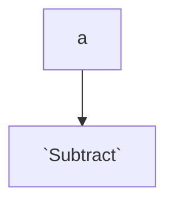

test

 

<!--MERMAID {width:100}-->

<!--MCONTENT {content: "graph TD \na \\-\\-\\> `Subtract`<swm-token data-swm-token=\":functions1.cs:12:5:5:`    public int Subtract(int a, int b)`\"/>"} --->

 

This file was generated by Swimm. [Click here to view it in the app](https://swimm-web-app.web.app/repos/Z2l0aHViJTNBJTNBY3NoYXJwLXNoYXVsLXRlc3QlM0ElM0Fzd2ltbWlv/docs/3uilhbnn).
