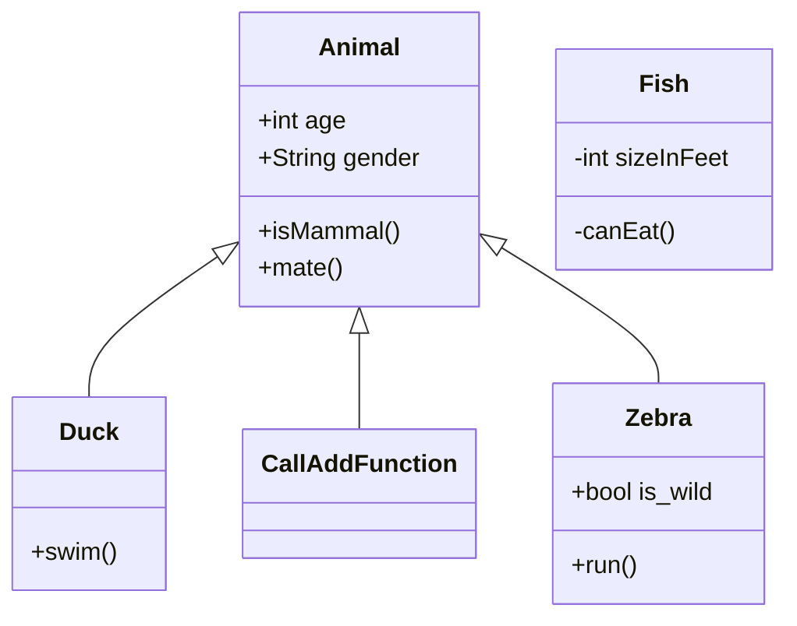

<!--MERMAID {width:50}-->

<!--MCONTENT {content: "classDiagram \nAnimal <|-- Duck \nAnimal <|-- `CallAddFunction`<swm-token data-swm-token=\":functions2.cs:5:5:5:`    public void CallAddFunction()`\"/> \nAnimal <|-- Zebra \nAnimal : +int age \nAnimal : +String gender \nAnimal: +isMammal() \nAnimal: +mate() \nclass Duck{ \n+swim() \n} \nclass Fish{ \n\\-int sizeInFeet \n\\-canEat() \n} \nclass Zebra{ \n+bool is\\_wild \n+run() \n} \n "} --->

 

This file was generated by Swimm. [Click here to view it in the app](https://swimm-web-app.web.app/repos/Z2l0aHViJTNBJTNBY3NoYXJwLXNoYXVsLXRlc3QlM0ElM0Fzd2ltbWlv/docs/m6vdztmi).
