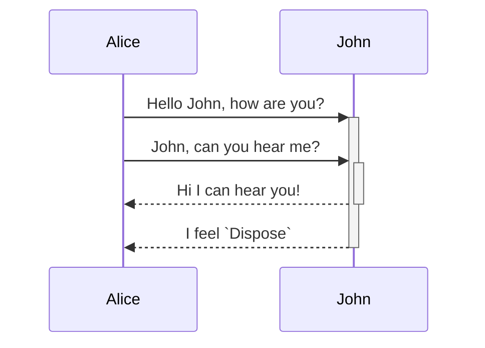
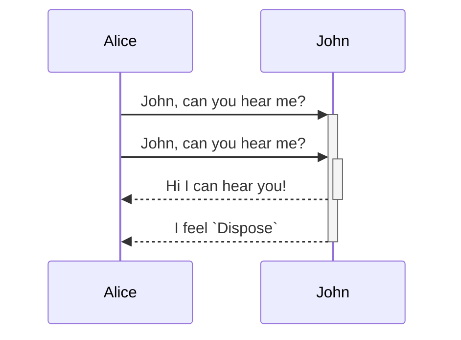

<!--MERMAID {width:50}-->

<!--MCONTENT {content: "sequenceDiagram<br/>\nAlice->>+John: Hello John, how are you?<br/>\nAlice->>+John: John, can you hear me?<br/>\nJohn\\-\\-\\>>-Alice: Hi I can hear you!<br/>\nJohn\\-\\-\\>>-Alice: I feel `Dispose`<swm-token data-swm-token=\":UnitOfWork.cs:22:5:5:`        public void Dispose()`\"/><br/>"} --->

<br/>

<br/>

<br/>

<!--MERMAID {width:50}-->

<!--MCONTENT {content: "sequenceDiagram<br/>\nAlice->>+John: John, can you hear me?<br/>\nAlice->>+John: John, can you hear me?<br/>\nJohn\\-\\-\\>>-Alice: Hi I can hear you!<br/>\nJohn\\-\\-\\>>-Alice: I feel `Dispose`<swm-token data-swm-token=\":UnitOfWork.cs:22:5:5:`        public void Dispose()`\"/>"} --->

<br/>

<br/>

<br/>

<br/>

<!--MERMAID {width:50}-->

<!--MCONTENT {content: "sequenceDiagram<br/>\nAlice->>+John: Hello John, how are you?<br/>\nAlice->>+John: John, can you hear me?<br/>\nJohn\\-\\-\\>>-Alice: Hi I can hear you!<br/>\nJohn\\-\\-\\>>-Alice: I feel `Dispose`<swm-token data-swm-token=\":UnitOfWork.cs:22:5:5:`        public void Dispose()`\"/>"} --->

<br/>

```
sequenceDiagram
Alice->>+John: John, can you hear me?
Alice->>+John: John, can you hear me?
John-->>-Alice: Hi I can hear you!
John-->>-Alice: I feel 
```

<br/>

<br/>

sequenceDiagram<br/>
Alice->>+John: John, can you hear me?<br/>
Alice->>+John: John, can you hear me?<br/>
John-->>-Alice: Hi I can hear you!<br/>
John-->>-Alice: I feel `Dispose`<swm-token data-swm-token=":UnitOfWork.cs:22:5:5:`        public void Dispose()`"/>

<br/>

This file was generated by Swimm. [Click here to view it in the app](https://swimm-web-app.web.app/repos/Z2l0aHViJTNBJTNBY3NoYXJwLXNoYXVsLXRlc3QlM0ElM0Fzd2ltbWlv/docs/4vptucrn).
