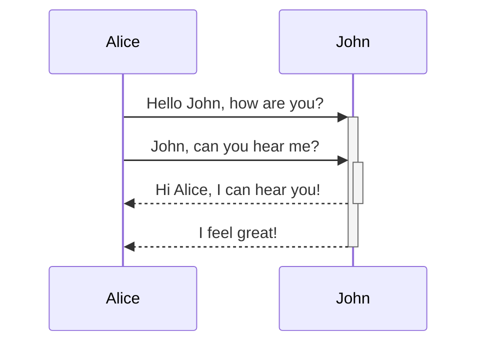

<!--MERMAID {width:100}-->

<!--MCONTENT {content: "sequenceDiagram \nAlice->>+John: Hello John, how are you? \nAlice->>+John: John, can you hear me? \nJohn\\-\\-\\>>-Alice: Hi Alice, I can hear you! \nJohn\\-\\-\\>>-Alice: I feel great! \n\n "} --->

 

This file was generated by Swimm. [Click here to view it in the app](https://app.swimm.io/repos/Z2l0aHViJTNBJTNBY3NoYXJwLXNoYXVsLXRlc3QlM0ElM0Fzd2ltbWlv/docs/4vptucrn).
