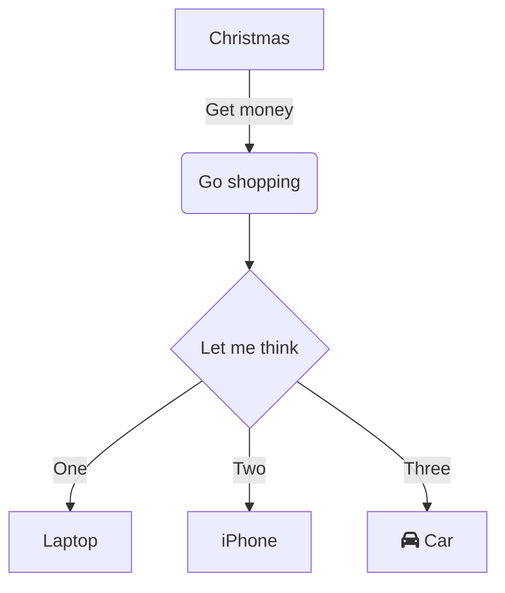

<!--MERMAID {width:100}-->

<!--MCONTENT {content: "graph TD<br/>\nA\\[Christmas\\] \\-\\-\\>|Get money| B(Go shopping)<br/>\nB \\-\\-\\> C{Let me think}<br/>\nC \\-\\-\\>|One| D\\[Laptop\\]<br/>\nC \\-\\-\\>|Two| E\\[iPhone\\]<br/>\nC \\-\\-\\>|Three| F\\[fa:fa-car Car\\]<br/>\n\n<br/>"} --->

<br/>

<!--MERMAID {width:100}-->
```mermaid

```
<!--MCONTENT {content: "<br/>"} --->

<br/>

This file was generated by Swimm. [Click here to view it in the app](https://swimm-web-app.web.app/repos/Z2l0aHViJTNBJTNBY3NoYXJwLXNoYXVsLXRlc3QlM0ElM0Fzd2ltbWlv/docs/mxhylj7v).
