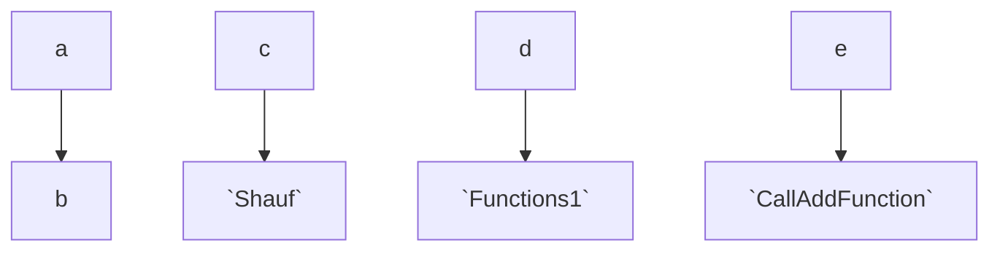

<!--MERMAID {width:100}-->

<!--MCONTENT {content: "graph TD \na \\-\\-\\> b \nc \\-\\-\\> `Shauf`<swm-token data-swm-token=\":repositories/TreatmentRepository.cs:9:3:3:`        public Shauf`\"/> \nd \\-\\-\\> `Functions1`<swm-token data-swm-token=\":functions1.cs:3:4:4:`public class Functions1`\"/> \ne \\-\\-\\> `CallAddFunction`<swm-token data-swm-token=\":functions2.cs:5:5:5:`    public void CallAddFunction()`\"/>"} --->

 

This file was generated by Swimm. [Click here to view it in the app](https://swimm-web-app.web.app/repos/Z2l0aHViJTNBJTNBY3NoYXJwLXNoYXVsLXRlc3QlM0ElM0Fzd2ltbWlv/docs/ya2b9oss).
