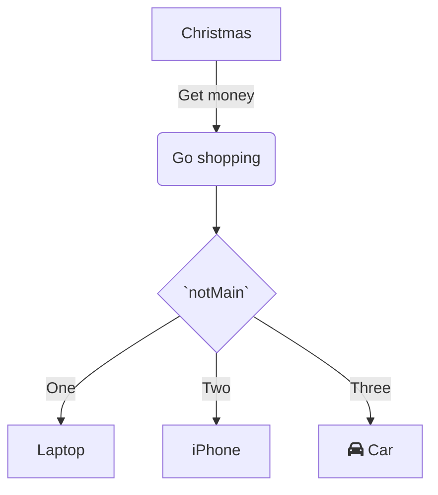
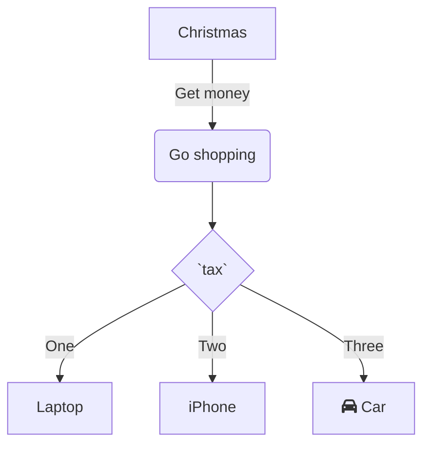

<!--MERMAID {width:50}-->
```mermaid
classDiagram
<br/>Animal <|-- Fish
Animal <|-- Zebra
Animal : +int age
Animal : +String gender
Animal: +isMammal()
Animal: +mate()
<br/>class Fish{
\-int `Shaut`
\-canEat()
}
class Zebra{
+bool is\_wild
+run()
}

```
<!--MCONTENT {content: "classDiagram<br/>\n<br/>Animal <|-- Fish<br/>\nAnimal <|-- Zebra<br/>\nAnimal : +int age<br/>\nAnimal : +String gender<br/>\nAnimal: +isMammal()<br/>\nAnimal: +mate()<br/>\n<br/>class Fish{<br/>\n\\-int `Shaut`<swm-token data-swm-token=\":repositories/TreatmentRepository.cs:9:3:3:`        public Shaut`\"/><br/>\n\\-canEat()<br/>\n}<br/>\nclass Zebra{<br/>\n+bool is\\_wild<br/>\n+run()<br/>\n}<br/>\n<br/>"} --->

<br/>

<!--MERMAID {width:100}-->

<!--MCONTENT {content: "graph TD<br/>\nA\\[Christmas\\] \\-\\-\\>|Get money| B(Go shopping)<br/>\nB \\-\\-\\> C{`notMain`<swm-token data-swm-token=\":Program.cs:1:6:6:`public static void notMain () {`\"/>}<br/>\nC \\-\\-\\>|One| D\\[Laptop\\]<br/>\nC \\-\\-\\>|Two| E\\[iPhone\\]<br/>\nC \\-\\-\\>|Three| F\\[fa:fa-car Car\\]<br/>\n<br/>"} --->

<br/>

<!--MERMAID {width:100}-->

<!--MCONTENT {content: "graph TD<br/>\nA\\[Christmas\\] \\-\\-\\>|Get money| B(Go shopping)<br/>\nB \\-\\-\\> C{`tax`<swm-token data-swm-token=\":repositories/TreatmentRepository.cs:11:1:1:`            tax { return Context as MyContext; }`\"/>}<br/>\nC \\-\\-\\>|One| D\\[Laptop\\]<br/>\nC \\-\\-\\>|Two| E\\[iPhone\\]<br/>\nC \\-\\-\\>|Three| F\\[fa:fa-car Car\\]<br/>\n<br/>"} --->

<br/>

This file was generated by Swimm. [Click here to view it in the app](https://swimm-web-app.web.app/repos/Z2l0aHViJTNBJTNBY3NoYXJwLXNoYXVsLXRlc3QlM0ElM0Fzd2ltbWlv/docs/3oxn9ns6).
