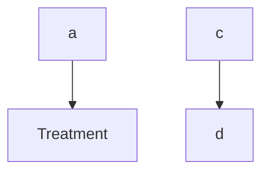

```mermaid
graph TD
a --> Treatment
c --> d

%% Swimm:
%% graph TD
%% a --> <SwmToken path="/models/Treatment.cs" pos="7:5:5" line-data="    public class Treatment">`Treatment`</SwmToken>
%% c --> d
```

<SwmMeta version="3.0.0" repo-id="Z2l0aHViJTNBJTNBY3NoYXJwLXNoYXVsLXRlc3QlM0ElM0Fzd2ltbWlv" repo-name="csharp-shaul-test">Powered by [Swimm](https://swimm-web-app.web.app/)</SwmMeta>
