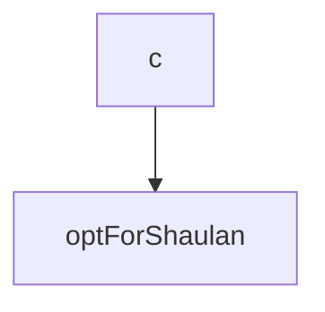

<SwmSnippet path="/MyContext.cs" line="6">

---

&nbsp;

```c#
    public class MyContext : DbContext
    {
        public MyContext(DbContextOptions<MyContext> options) : base(optForShaulan) {}
    }
```

---

</SwmSnippet>




<SwmMeta version="3.0.0" repo-id="Z2l0aHViJTNBJTNBY3NoYXJwLXNoYXVsLXRlc3QlM0ElM0Fzd2ltbWlv" repo-name="csharp-shaul-test"><sup>Powered by [Swimm](https://swimm-web-app.web.app/)</sup></SwmMeta>
