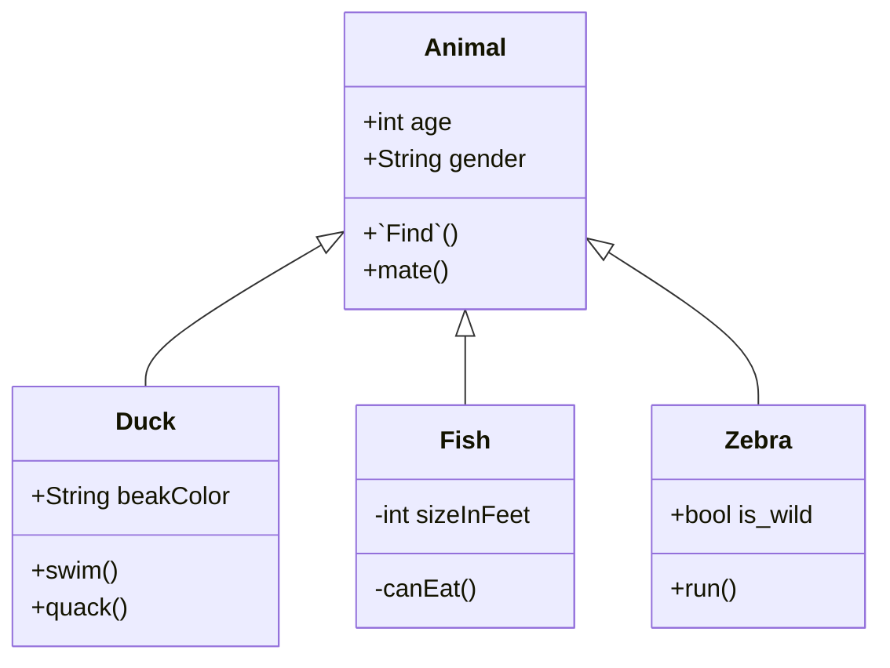

<!--MERMAID {width:100}-->

<!--MCONTENT {content: "classDiagram \nAnimal <|-- Duck \nAnimal <|-- Fish \nAnimal <|-- Zebra \nAnimal : +int age \nAnimal : +String gender \nAnimal: +`Find`<swm-token data-swm-token=\":repositories/IRepository.cs:11:6:6:`        IEnumerable&lt;TModel&gt; Find(Expression&lt;Func&lt;TModel, bool&gt;&gt; predicate);`\"/>() \nAnimal: +mate() \nclass Duck{ \n+String beakColor \n+swim() \n+quack() \n} \nclass Fish{ \n\\-int sizeInFeet \n\\-canEat() \n} \nclass Zebra{ \n+bool is\\_wild \n+run() \n} \n\n "} --->

 

This file was generated by Swimm. [Click here to view it in the app](https://app.swimm.io/repos/Z2l0aHViJTNBJTNBY3NoYXJwLXNoYXVsLXRlc3QlM0ElM0Fzd2ltbWlv/docs/td4xp0vz).
