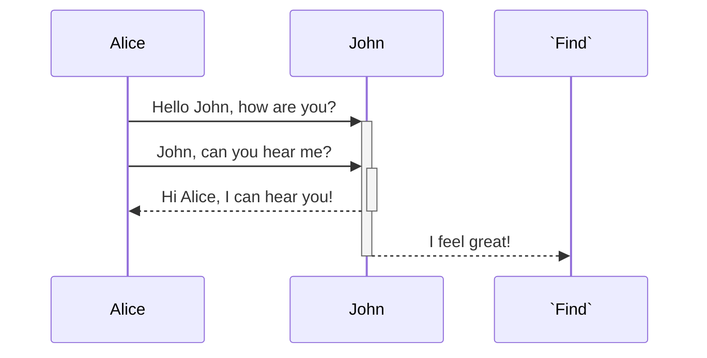

<!--MERMAID {width:100}-->

<!--MCONTENT {content: "sequenceDiagram \nAlice->>+John: Hello John, how are you? \nAlice->>+John: John, can you hear me? \nJohn\\-\\-\\>>-Alice: Hi Alice, I can hear you! \nJohn\\-\\-\\>>-`Find`<swm-token data-swm-token=\":repositories/IRepository.cs:11:6:6:`        IEnumerable&lt;TModel&gt; Find(Expression&lt;Func&lt;TModel, bool&gt;&gt; predicate);`\"/>: I feel great! \n\n "} --->

 

This file was generated by Swimm. [Click here to view it in the app](https://swimm-web-app.web.app/repos/Z2l0aHViJTNBJTNBY3NoYXJwLXNoYXVsLXRlc3QlM0ElM0Fzd2ltbWlv/docs/rovzkpyh).
