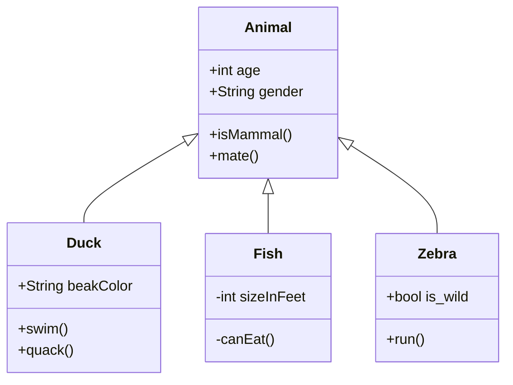

<!-- NOTE-swimm-snippet: the lines below link your snippet to Swimm -->
### 📄 NewCode.cs
```c#
16                 // Commit 1
17                 // Commit 2 - develop keeps going
18                 // Commit 3 - develop goes more
19                 // Commit 4 - develop goes more forward
20                 var builder = new ConfigurationBuilder()
21                     .SetBasePath(Directory.GetCurrentDirectory())
22                     .AddJsonFile("global.json");
23                 string conString = builder.Build().GetConnectionString("DefaultConnection");
24                 // I want to cherry pick this to the tag.
25     
26                 MyContext myContext = MyContextFactory.Create(conString);
27                 TreatmentRepository tr = new TreatmentRepository(myContext);
28                 foreach (Treatment item in tr.GetAll())
29                 {
30                     Console.WriteLine(item.Text);
31                 }
```

<br/>

<!--MERMAID {width:100}-->

<!--MCONTENT {content: "classDiagram<br/>\nAnimal <|-- Duck<br/>\nAnimal <|-- Fish<br/>\nAnimal <|-- Zebra<br/>\nAnimal : +int age<br/>\nAnimal : +String gender<br/>\nAnimal: +isMammal()<br/>\nAnimal: +mate()<br/>\nclass Duck{<br/>\n+String beakColor<br/>\n+swim()<br/>\n+quack()<br/>\n}<br/>\nclass Fish{<br/>\n\\-int sizeInFeet<br/>\n\\-canEat()<br/>\n}<br/>\nclass Zebra{<br/>\n+bool is\\_wild<br/>\n+run()<br/>\n}<br/>\n\n<br/>"} --->

<br/>

This file was generated by Swimm. [Click here to view it in the app](https://swimm-web-app.web.app/repos/Z2l0aHViJTNBJTNBY3NoYXJwLXNoYXVsLXRlc3QlM0ElM0Fzd2ltbWlv/docs/22ptufzi).
